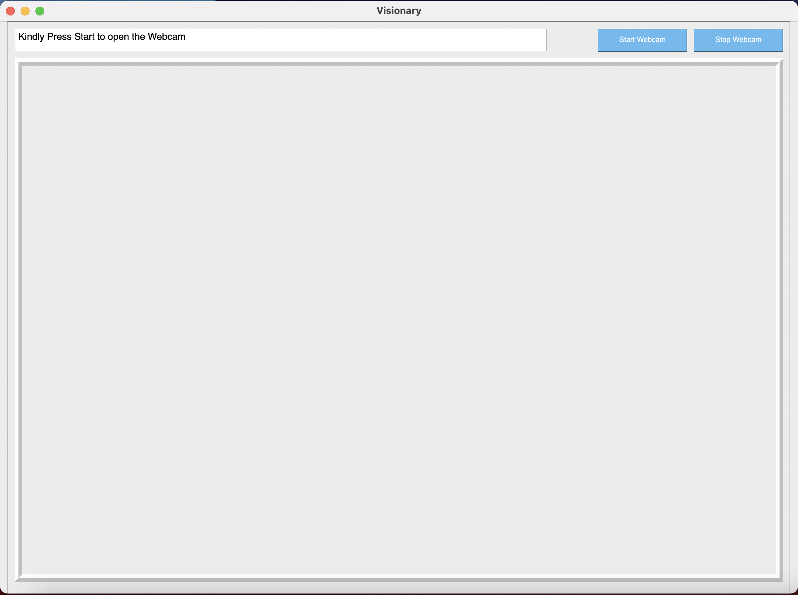

# Visionary 

**IRIS Movement Detection System**.

## Instructions

1. Run the following installation commands from CLI Terminal inside the cloned directory:

For Windows / LINUX:

```
$ pip install -r requirements.txt
```

For MacOS:

```
$ pip3 install -r requirements.txt
```

2. Run **Start.py** file from CLI Terminal inside the cloned directory:

For Windows / LINUX:

```
$ python Start.py
```

For MacOS:

```
$ python3 Start.py
```

3. Click Start Webcam


