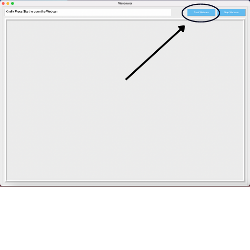
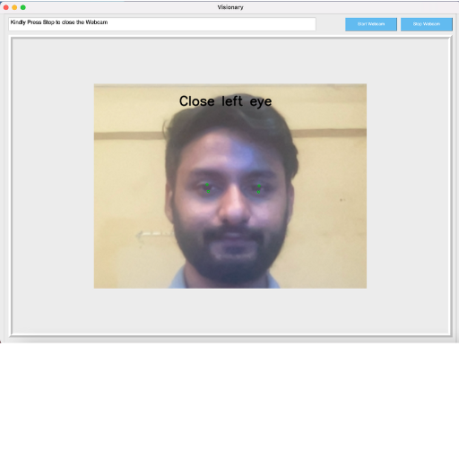
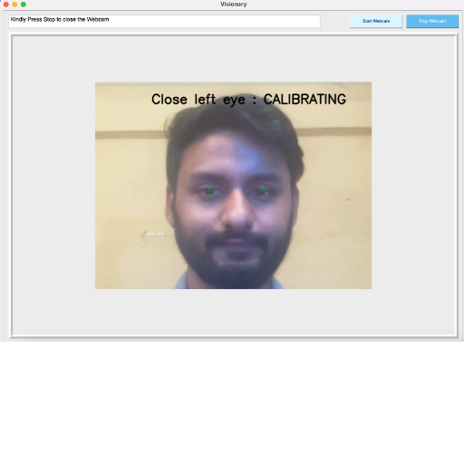
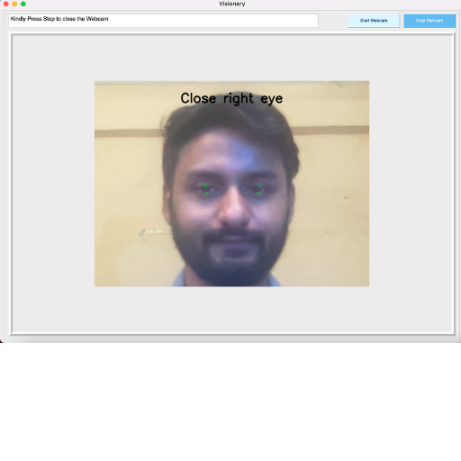
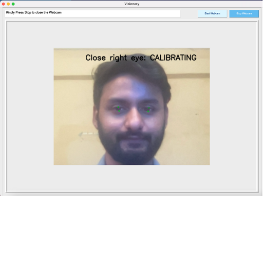
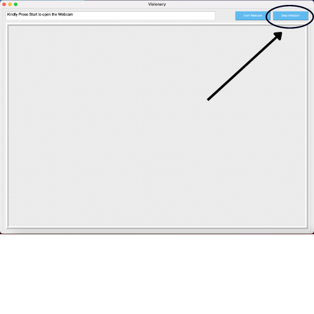

# Visionary 👀

**IRIS Movement Detection System**.

## Instructions

1. Run the following installation commands from CLI Terminal inside the cloned directory:

For Windows / LINUX:

```
$ pip install -r requirements.txt
```

For MacOS:

```
$ pip3 install -r requirements.txt
```

2. Run **Start.py** file from CLI Terminal inside the cloned directory:

For Windows / LINUX:

```
$ python Start.py
```

For MacOS:

```
$ python3 Start.py
```

3. Click Start Webcam to turn on camera



4. Calibrate Left Eye




5. Calibrate Right Eye




6. Control Away! Move your Iris around for smooth mouse control. 
We even added a left and right mouse functionality for you.😎


7. Click Stop Webcam to turn off camera



